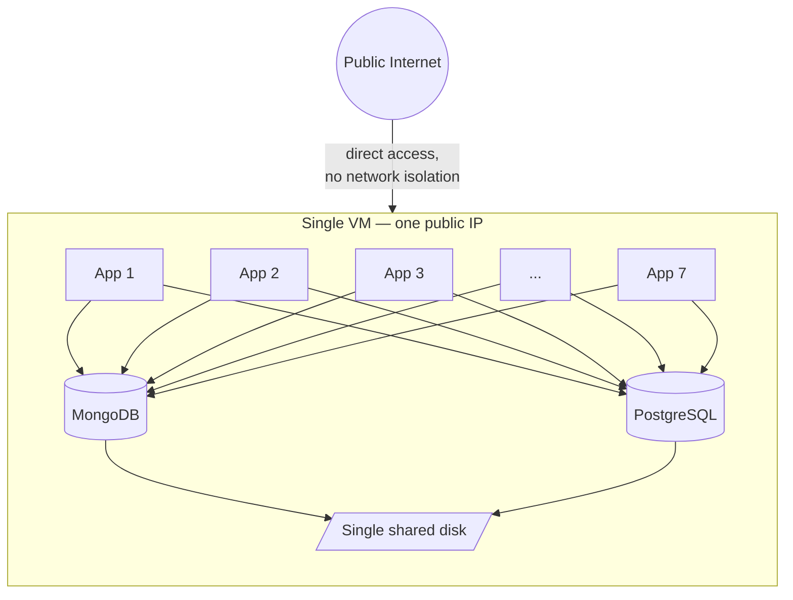
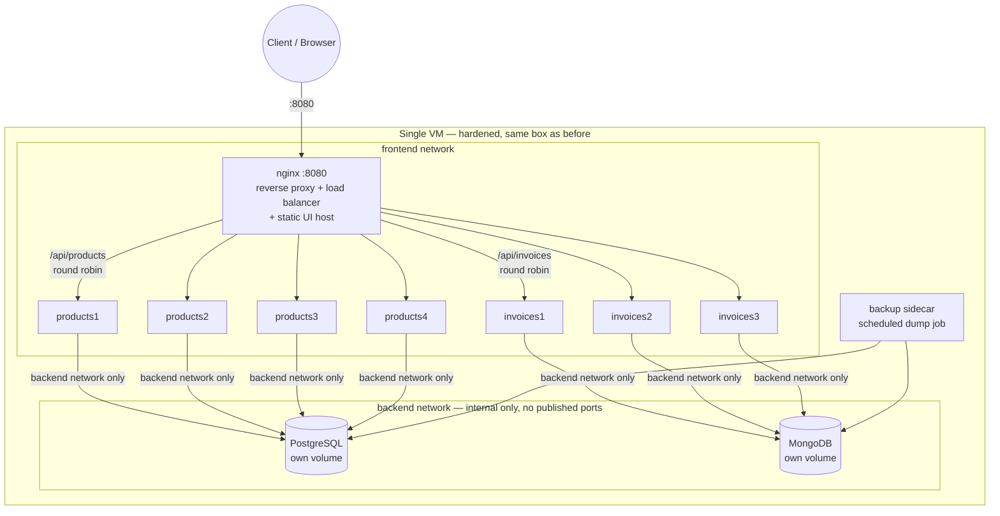
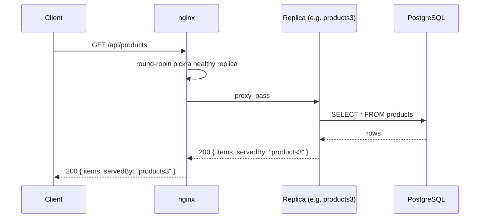
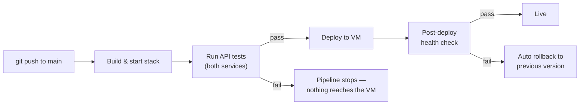

# Application Lead Assignment — Zenalyst AI

## The problem, restated

One VM, one public IP. Docker Compose runs 7 app containers plus MongoDB and
PostgreSQL, both on the same box, both writing to that box's disk. Deploys are
a `git pull` + restart. It's cheap and it hasn't failed yet — but "hasn't
failed yet" is doing a lot of work in that sentence.

The brief asked for **reasoning and order of work**, not a diagram of the
ideal end state. So this README is organized as: what breaks first, why, and
what I'd do about it — in the order I'd actually do it. The diagrams below are
infrastructure only (containers, networks, request flow) — no business logic,
since that's explicitly not what's being evaluated here.



Every failure mode here — disk full, VM crash, bad deploy, a traffic spike,
an exposed DB port — takes down the whole system at once, because nothing is
isolated from anything else.

## How I prioritized

I ranked risks by **(likelihood × blast radius) ÷ cost to fix**, not by
architectural elegance.

| # | Risk | Why it's ranked here |
|---|------|----------------------|
| 1 | No backups / shared disk for both DBs | Silent until it isn't — then it's total, irreversible data loss. Cheapest fix on this list. Fix before touching anything else. |
| 2 | DB ports potentially reachable from the public internet | A single public IP with no explicit network isolation is one misconfigured `EXPOSE`/firewall rule away from an open database. Fixed before scaling anything, because scaling a leaky system just gives attackers more surface. |
| 3 | Deploys are pull-and-restart | Every deploy is a mini-outage with no rollback. Matters *especially* while migrating, since you'll be deploying constantly during the migration itself. |
| 4 | Mongo + Postgres contend for one disk's I/O | A slow query in one database can now starve the other. A correctness/performance risk, distinct from #1 — backups protect the data, this protects the day-to-day. |
| 5 | Single VM = single point of failure | Only tackled once 1–4 are solid, because adding redundancy to an insecure, unbacked-up, badly-deployed system just replicates the problem. |
| 6 | No observability | Needed to *know* whether 1–5 are actually fixed, but dashboards before the underlying risks are addressed is polishing the mirror on a sinking ship. |

## The hardened architecture (Phase 0 — this repo)



**Why two Docker networks, not one:** `frontend` carries client-facing
traffic (nginx ↔ app replicas). `backend` is marked `internal: true` in
`docker-compose.yml`, meaning Docker refuses to route it to the outside world
at all — the databases are not reachable from the public internet even if
nginx is fully compromised, because there's no network path out. This is
risk #2's actual fix, not just a firewall rule that could be misconfigured.

**Why uneven replica counts (4 vs. 3):** deliberately different, so it's
visibly obvious in a live demo that nginx is load-balancing each service
independently rather than the two happening to match by coincidence.

### Request flow, end to end



`servedBy` is set from an explicit `INSTANCE_NAME` environment variable per
replica (not Docker's default hostname — see "What's in this repo"), which is
what lets the UI prove, request by request, which replica actually handled
each call.

### Deploy pipeline (fix for risk #3)



This replaces "pull and restart" with a gate: a deploy only reaches the VM
if tests pass, and a bad deploy is automatically reverted rather than left
serving errors until someone notices.

## Risk-by-risk: what's actually implemented, and where

| Risk | Implementation | File(s) |
|---|---|---|
| **#1 — No backups** | Sidecar container running scheduled `mongodump`/`pg_dump` to dedicated backup volumes, 7-day local retention | `scripts/backup.sh`, `scripts/Dockerfile` |
| **#2 — DB ports exposed** | Both databases on an `internal: true` Docker network with no `ports:` published — physically unreachable from outside the VM | `docker-compose.yml` (`backend` network) |
| **#3 — Pull-and-restart deploys** | CI gate: build → test → deploy → automatic rollback on failed health check | `.github/workflows/ci-cd.yml` |
| **#4 — Disk I/O contention** | Separate named volumes per database, plus per-container CPU/memory limits so neither starves the other | `docker-compose.yml` (`mongo_data`, `postgres_data`, `deploy.resources.limits`) |
| **#5 — Single point of failure** | Demonstrated at the app tier now: 4 products replicas / 3 invoices replicas behind nginx, health-checked, round-robin load balanced | `docker-compose.yml`, `nginx/nginx.conf` |
| **#6 — No observability** | `/health` endpoint per service (liveness) is the foundation; full dashboards intentionally deferred to Phase 1 (see below) | `*/controller.js` |

Note risk #5 is only *partially* solved here — replicas protect against one
container crashing, not the VM itself dying. Full redundancy needs multiple
VMs/AZs, which is a Phase 1 item (below), consistent with the priority order:
app-tier redundancy is cheap and ships now, VM-level redundancy needs AWS
spend and is staged deliberately.

## What's in this repo

- **`products-service/`** — Express + PostgreSQL. `POST/GET/DELETE /products`.
  4 replicas (`products1`–`products4`). Split into `routes.js` (HTTP paths)
  → `controller.js` (business logic) → `db.js` (connection + queries),
  rather than one file — small enough to stay simple, structured enough to
  show the pattern.
- **`invoice-service/`** — Express + MongoDB. `POST/GET/DELETE /invoices`.
  3 replicas (`invoices1`–`invoices3`). Same `routes/controller/db` split.
- Each replica gets an explicit `INSTANCE_NAME` environment variable in
  `docker-compose.yml` (e.g. `INSTANCE_NAME=products3`), rather than relying
  on Docker's default hostname — this is what `servedBy` in every API
  response is built from. Explicit env var over hostname because it doesn't
  depend on Docker-specific behavior and travels unchanged if this ever
  moves to ECS/k8s, where "hostname" often means a random pod ID instead.
- **`docker-compose.yml`** — isolates both databases on the internal-only
  `backend` network, adds per-container resource limits, and adds health
  checks so Compose/nginx know when a replica is actually ready.
- **`nginx/nginx.conf`** — the single public entry point. Routes
  `/api/products` and `/api/invoices` to their respective upstream (this is
  **routing**, since they're different services), and load-balances
  round-robin across each service's own replica pool (this is **load
  balancing**, since those are identical instances). Also serves the static
  UI.
- **`ui/index.html`** — plain HTML + vanilla JS (no build step, no
  framework — the assignment is an infrastructure test, not a frontend
  one). Create/list/delete products and invoices live. Each tab shows a
  strip of every known replica for that service, with the one that served
  the most recent request highlighted — a single API response only tells
  you which *one* replica handled it, so the highlight updates per-request
  rather than showing all replicas' state simultaneously.
- **`scripts/backup.sh` + `scripts/Dockerfile`** — a sidecar container
  running scheduled `mongodump`/`pg_dump` to a local volume with 7-day
  retention. Runs under `tini` (fixes a `crond` process-group restriction
  some container runtimes enforce) and strips CRLF line endings at build
  time for portability. The offsite-sync (S3) step is a deliberate stub —
  see below.
- **`products-service/test.js`, `invoice-service/test.js`** — basic API
  tests (create, get, list, validation, delete, 404-after-delete) for each
  service. Not exhaustive — enough to prove the pattern and give concrete
  material to defend line-by-line, per the assignment's requirement.
- **`.github/workflows/ci-cd.yml`** — build → test → deploy → rollback
  pipeline, diagrammed above. The deploy/rollback steps are stubs (no real
  target VM in a take-home context) but the gate structure — nothing ships
  without passing tests, nothing stays deployed without passing its health
  check — is real and is the part that matters.

## Target state (Phase 1 — once Phase 0 is stable, migrate to AWS)

This is the direction, not something built out in code, because the brief
asked for reasoning over a perfect-system diagram:

- **RDS (Postgres) + DocumentDB or Atlas (Mongo)** instead of self-hosted —
  automated backups, multi-AZ failover, patching handled for you. Retires
  risks #1 and #4 for good.
- **Security groups scoping DB access to the app tier only**, no public DB
  endpoints at all — hardens risk #2 beyond what a Docker network boundary
  gives you.
- **ECS/Fargate behind an ALB** instead of docker-compose on one VM —
  rolling deploys with automatic rollback (risk #3), and true horizontal
  scaling / no single point of failure at the VM level (risk #5).
- **CloudWatch (or equivalent) for logs/metrics/alarms** — risk #6.
- **Monitoring & alerting** — set up CloudWatch (or equivalent) dashboards and alerts for 
  service health, errors, latency, resource usage, database health, and deployment failures, with notifications to the appropriate channel.


## Assumptions

- The 7 application containers are stateless (session/state lives in the DBs,
  not in-process) — if not, the load-balancing story in `nginx.conf` and the
  ECS target state both need sticky sessions or a shared session store, which
  I did not build.
- Traffic volume is modest enough that a single VM was viable at all — this
  informed the "fix in place first, migrate second" order rather than an
  immediate full rewrite.
- There's no compliance requirement (HIPAA/PCI/etc.) driving specific
  encryption-at-rest or audit-log requirements beyond general good practice.
- Downtime for the Phase 0 migration itself (a few minutes, during a
  maintenance window) is acceptable — Phase 1 is where zero-downtime deploys
  actually get solved.

## Cost and trade-offs (Phase 1 / AWS migration)

Every Phase 1 item has a cost, and part of leading this migration is being
upfront about them rather than presenting "move to AWS" as free:

- **RDS + DocumentDB/Atlas vs. self-hosted**: meaningfully more expensive
  per month than two DB processes on one VM — you're paying for automated
  backups, multi-AZ failover, and patching, not just compute. Worth it once
  the cost of a single data-loss incident (which is what Phase 0's backups
  are a stopgap against) exceeds the price delta. I'd size this against
  actual traffic/revenue numbers before committing, not assume it by default.
- **ECS/Fargate vs. one VM**: more moving parts to operate (task definitions,
  service discovery, ALB config) — a real cost in team ramp-up time, not
  just dollars. This is where an Application Lead's job is to decide if the
  team is ready to own that complexity, or if it's staged in over a quarter.
- **Migration risk itself**: cutting over a live database is the highest-risk
  step in this whole plan — more risk than any of the Phase 0 changes,
  which are all reversible with a `docker-compose down`. This is why it's
  ordered last and staged (see rollout plan below), not done in one shot.

## Rollout plan

1. **Phase 0 ships first, on the existing VM**, during a short maintenance
   window (a few minutes of downtime for the network/compose changes). This
   is low-risk and immediately reduces the two biggest risks (data loss,
   public DB exposure) without touching AWS at all.
2. **Communicate the maintenance window** to whoever depends on uptime,
   with rollback being "redeploy the previous compose file" — cheap, since
   nothing external has changed yet.
3. **Stage the AWS migration database-first**, starting with whichever of
   Mongo/Postgres has lower write volume, to prove the migration pattern
   before touching the busier one. Use a dual-write or read-replica cutover
   (write to both old and new during a transition window, verify parity,
   then cut reads over) rather than a single hard cutover — this is the
   step where downtime and data-loss risk are both highest, so it gets the
   most caution, not the least.
4. **App tier moves to ECS after the databases are stable on AWS**, not
   before — moving compute first while data still lives on the VM adds
   network hops and a second thing to debug simultaneously.
5. **Keep the old VM running, untouched, until the new stack has run in
   production for a full billing/traffic cycle** — cheap insurance against
   an issue that only shows up under real load.

## What I deliberately left out, and why

- **Offsite backup sync (S3) is a stub, not implemented.** Wiring it up
  needs real AWS credentials/IAM scoping that don't exist in a take-home
  context — the script is structured so it's a one-line swap once they do.
- **TLS is not implemented in this demo build** (nginx serves plain HTTP on
  `:8080`). Dropped so the whole stack — including the UI — can be
  `docker-compose up`'d and clicked through on a clean machine with zero
  certificate setup. The nginx config in Phase 1 would add
  `ssl_certificate` directives; it's a config addition, not an architecture
  change.
- **Only 2 of the original 7 app containers are represented as full
  services** (products, invoices), with 4 and 3 replicas respectively. The
  remaining 5 would follow the identical pattern — duplicating a 3rd, 4th,
  5th service adds repetition without adding new reasoning. In a real PR
  I'd factor the repeated replica blocks into a Compose extension/YAML
  anchor rather than copy-paste.
- **No Terraform/CloudFormation for the Phase 1 AWS target state.** The
  brief asked for reasoning and order of work over a diagram of the perfect
  system, so I described the target state and the reasoning behind each
  piece rather than building infra-as-code for an environment I'd be
  provisioning blind.
- **Auth/authz within the app layer** — out of scope for an infrastructure
  question; the demo services have no login system.
- **The deploy/rollback steps in `ci-cd.yml` are stubs**, not wired to a
  real VM — there's no actual target host in a take-home context, and
  faking SSH credentials against nothing felt like it would obscure the
  actual point (the gate structure) rather than demonstrate it. The
  build→test gate and the rollback trigger condition are both real and
  would need only host/SSH secrets to go live.

## Running it

```bash
cp .env.example .env
docker-compose up --build
```

- **UI**: `http://localhost:8080` — create/list/delete products and invoices,
  watch `servedBy` alternate between replicas as you refresh
- **Products API directly**: `curl http://localhost:8080/api/products`
- **Invoices API directly**: `curl http://localhost:8080/api/invoices`
- **Health checks**: `curl http://localhost:8080/health`
- Backups land in the `mongo_backups`/`postgres_backups` volumes; inspect with
  `docker-compose exec backup ls /backups/mongo`

### Proving load balancing live in the interview

1. Open the UI, add a product.
2. Refresh the products list a few times — watch the `servedBy` tag (and the
   replica strip in the UI) move between `products1`–`products4` (nginx
   round-robin).
3. Optionally, `docker-compose stop products1` mid-demo and show requests
   keep succeeding — nginx stops routing to the dead replica once its
   healthcheck fails.
